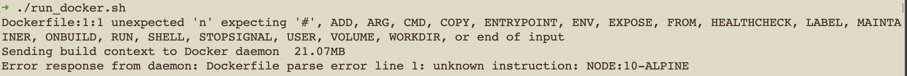
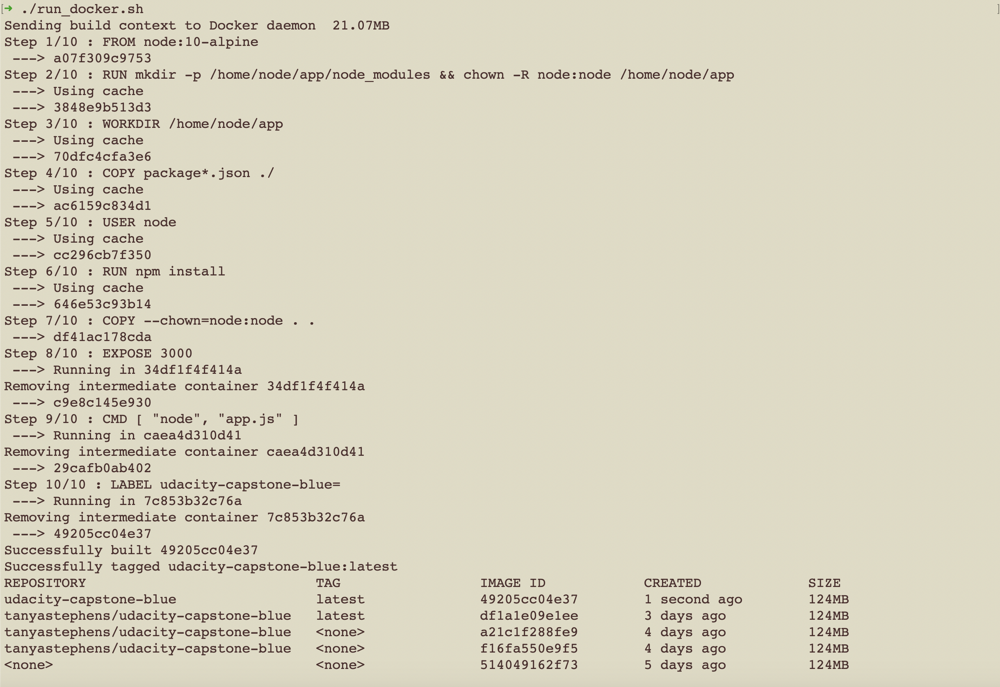
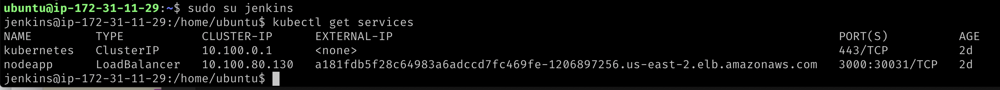
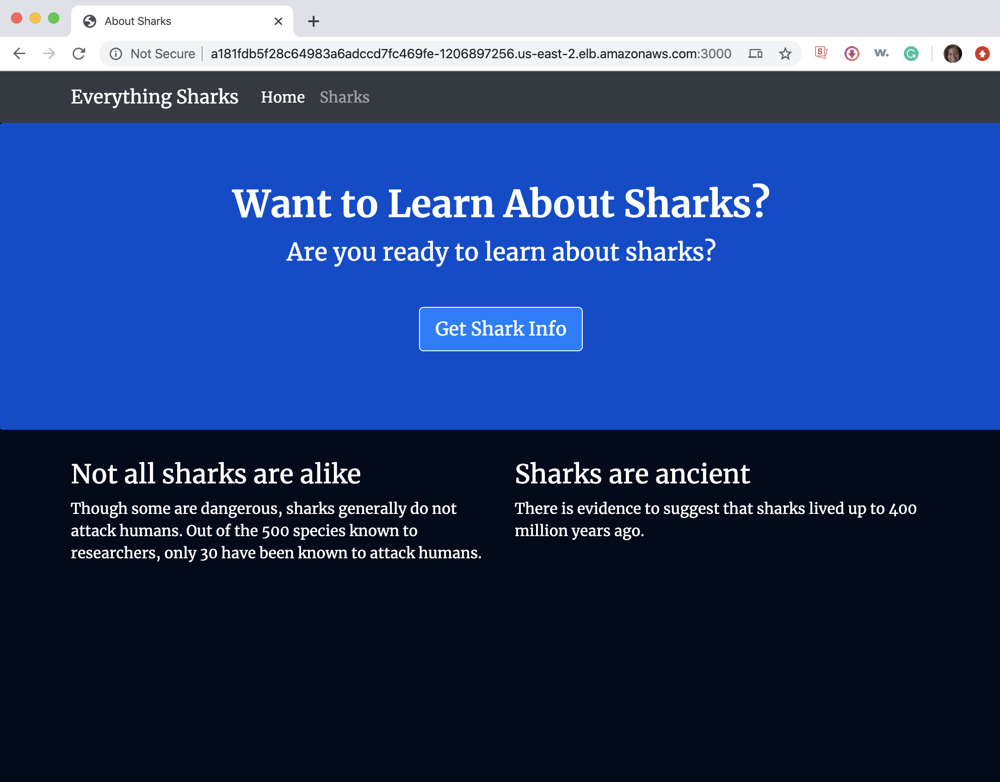
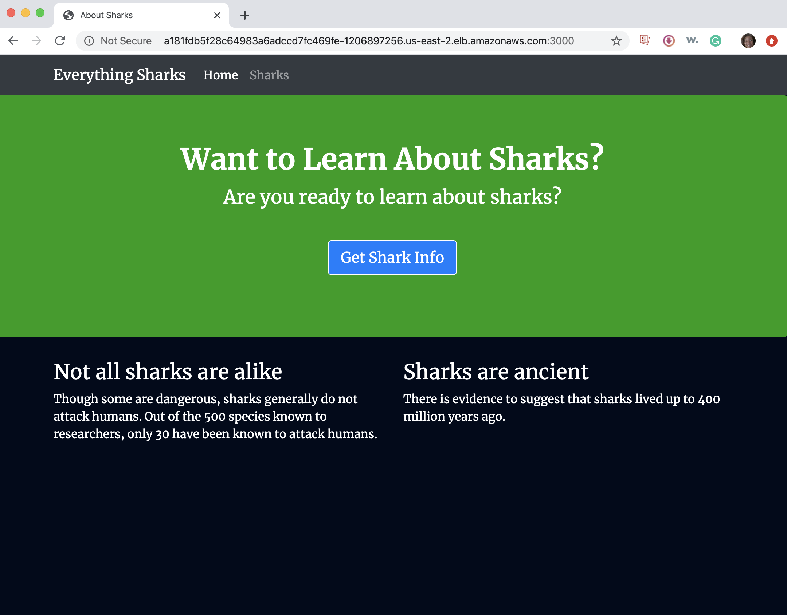

# Capstone Project #

This capstone project uses NodeJS, Docker, Jenkins, AWS EKS, and shell scripts to create a blue/green deployment pipeline.

## STEP ONE: BUILD A JENKINS INSTANCE ##

The Jenkins instance is built from an AWS CloudFormation template. The template file is located at [ buildjenkins/buildjenkins.yaml ]( buildjenkins/buildjenkins.yaml ). The template includes network components (VPC, Subnet, Internet Gateway, Elastic IP, Route Table), IAM components (Role, Security Group), and EC2 instance information (instance type, image id, volume size and type). The UserData section is used to add Jenkins as well as other packages to the EC2 instance. The packages include (java, jq, zip, hadolint, AWS CLI, eksctl, kubectl)

The command to run the template is:

     aws cloudformation create-stack --stack-name <stackname> --template-body file:buildjenkins.yaml --capabilities CAPABILITY_NAMED_IAM

After the ec2 instance is built, the IP address can be obtained from the console. The link for the Jenkins instance is:

     http://<IP ADDRESS>:8080

On first login a screen appears with the location of the Jenkins admin password. Use SSH to login to the server from a terminal window. The password can be obtained by using more,less, or cat to list the file contents. For example:
     
     sudo more /var/lib/jenkins/secrets/initialAdminPassword
     a620dl28eff14892b1ad9dc2b3ceaab2

Use the password to login and create a separate admin account with a separate username and password.

Next install the suggested plugins. After Jenkins restarts, login with the username and password created in a previous step.

Select Manage Jenkins -->Manage Plugins to add plugins. Click the Available tab and use the Filter field to search for and install the plugins listed below.

 The Jenkins plugins used are: 
 
    * Green Balls - Successful builds appear as green balls instead of the default blue.
    * Blue Ocean - A set of plugins to simplify Jenkins pipelines
    * CloudBees AWS Credentials Plugin - Connects Jenkins with AWS credentials
    * CloudBees Docker Build and Publish plugin - Connects Jenkins with Docker/Dockerhub
    * Github - Connects Jenkins with Github
    * Pipeline - A suite of plugins to help build and automate pipelines
    * Pipeline: AWS Steps - Integrates Jenkins pipelines with AWS
    * SSH Credentials - Allows Jenkins to be accessed via ssh

## STEP TWO: DOCKERIZE AN APPLICATION ##

A nodejs application that consists of a couple of webpages is used for this assignment. The nodejs application also uses the Bootstrap library for common components. There are two versions of the application, one with a blue background and the other with a green background, making it easy to identify the deployments. The nodejs application is converted to a Docker image based on a Dockerfile. The Dockerfile is checked for errors (linted). The [ Dockerfile ]( blue/Dockerfile ) contents are explained below.

     FROM node:10-alpine - Pull the image from the Docker repository

     RUN mkdir -p /home/node/app/node_modules && chown -R node:node /home/node/app - Make a directory and change ownership

     WORKDIR /home/node/app - Change to the main directory

     COPY package*.json ./ - Use a wildcard to copy both the package.json and the package-lock.json files

     USER node - Set the user

     RUN npm install - Install the app and dependencies

     COPY --chown=node:node . . - Copy the files and change ownership

     EXPOSE 3000 - Expose the port for the application

     CMD [ "node", "app.js" ] - Start the application

The command to execute the Dockerfile is:

    docker build -f Dockerfile --tag=<filename> --label=<filename> .

However, a script is used to include a step to lint the file. The [ run_docker.sh ]( blue/run_docker.sh ) script is shown below:

     #!/usr/bin/env bash

     ## Complete the following steps to get Docker running locally

     # Step 1:
     # Lint the Dockerfile
     # This is linter for Dockerfiles
     hadolint Dockerfile

     # Step 2:
     # Build image and add a descriptive tag
     docker build -f Dockerfile --tag=<filename> --label=<filename> .

     # Step 3:
     # List docker images
     docker image ls --filter label=<filename> 

Hadolint is used to check the Dockerfile for errors. If an error is found, the output is like:

The output of a file without errors is like:

After the Docker image is built, another script ([ upload_docker.sh ]( blue/upload_docker.sh )) is used to upload the image to Dockerhub.

The above procedures are executed twice, once for the blue application and again for the green application.

## STEP THREE: ADD TO GITHUB REPOSITORY ##

A Githib repository is needed to proceed to the next step. Create a new GitHub repository and add the files created in the previous steps. The repository will be connected to the Jenkins pipeline jobs. If a change is committed to the Github repository, the Jenkins pipeline can be set to update automatically.

## STEP FOUR: BUILD A KUBERNETES CLUSTER ##

The next step is to build a Kubernetes cluster for the applications using the Amazon Web Services (AWS) Elastic Kubernetes Service (EKS). EKS is a managed service to simplify building and managing Kubernetes on the AWS platform. In order to use Jenkins to create a pipeline to build the EKS cluster, AWS and Github credentials are added to the global configuration. The following Jenkinsfile is used to build the cluster with 2 nodes.

      pipeline {
        agent any
        stages {

                stage('Create kubernetes cluster') {
                        steps {
                                withAWS(region:'us-east-2', credentials:'capstone-credentials') {
                                        sh '''
                                                eksctl create cluster \
                                                --name capstone \
                                                --version 1.15 \
                                                --nodegroup-name standard-workers \
                                                --node-type t2.micro \
                                                --nodes 2 \
                                                --nodes-min 1 \
                                                --nodes-max 3 \
                                                --node-ami auto \
                                                --region us-east-2 \
                                                --zones us-east-2a \
                                                --zones us-east-2b \
                                                --zones us-east-2c \
                                        '''
                                }
                        }
                }

                stage('Create conf file cluster') {
                        steps {
                                withAWS(region:'us-east-2', credentials:'capstone-credentials') {
                                        sh '''
                                                aws eks --region us-east-2 update-kubeconfig --name capstone
                                        '''
                                }
                        }
                }

After the pipeline has executed successfully, disable the pipeline so it doesn't attempt to execute when changes to the Github repo are made.

## STEP FIVE: BLUE/GREEN DEPLOYMENTS ##

Once the cluster is built, the applications inside the Docker container are ready to be deployed. A Jenkinsfile moves the blue and green containers to EKS and makes the blue application active via a service. The contents of the Jenkinsfile are:

     pipeline {
        agent any
        stages {

        stage('Set current kubectl context') {
                        steps {
                                withAWS(region:'us-east-2', credentials:'capstone-credentials') {
                                        sh '''
                                                kubectl config use-context arn:aws:eks:us-east-2:1212758xxxxx:cluster/capstone
                                        '''
                                }
                        }
                }

                stage('Deploy the blue container in the cluster') {
                        steps {
                                withAWS(region:'us-east-2', credentials:'capstone-credentials') {
                                        sh '''
                                                kubectl apply -f ./blue.yaml
                                        '''
                                }
                        }
                }
                stage('Deploy the green container in the cluster') {
                        steps {
                                withAWS(region:'us-east-2', credentials:'capstone-credentials') {
                                        sh '''
                                                kubectl apply -f ./green.yaml
                                        '''
                                }
                        }
                }
                stage('Deploy the service in the cluster, point to blue') {
                        steps {
                                withAWS(region:'us-east-2', credentials:'capstone-credentials') {
                                        sh '''
                                                kubectl apply -f ./service.yaml
                                        '''
                                }
                        }
                }

        }
     }  

## STEP SIX: VIEW ACTIVE DEPLOYMENT ##

The external address for the active deployment can be obtained via the kubectl command. 
     
     1. Login via ssh to the Jenkins server as user ubuntu

        ssh ubuntu@xxx.xxx.xxx.xxx

     2. Switch to the jenkins user 

        sudo su - jenkins

     3. Run the kubectl command

        kubectl get services

        The output is like:
        
   
       
     4. Open the URL in a browser at port 3000, for example:

        http://a181fdb5f28c64983a6adccd7fc469fe-1206897256.us-east-2.elb.amazonaws.com:3000/

     5. The blue deployment is active

   

## STEP SEVEN: SWITCH ACTIVE DEPLOYMENT ##

The deployment can be switched by making changes to the service.yaml file and using the kubectl command.

     1. Edit the file at ~/workspace/<project name>/service.yaml file and change the version reference from blue to green

        apiVersion: v1
        kind: Service
        metadata:
        name: nodeapp
        labels:
          name: nodeapp
        spec:
        ports:
          - name: http
            port: 3000
            targetPort: 3000
        selector:
          name: nodeapp
          version: "blue"  ## switch to green ##
        type: LoadBalancer

     2. Run the kubectl command

        kubectl apply -f service.yaml

     3. Open or refresh the URL in a browser at port 3000, for example:

        http://a181fdb5f28c64983a6adccd7fc469fe-1206897256.us-east-2.elb.amazonaws.com:3000/

     4. The green deployment is active

   

A script at ~/workspace/<project name>/bg_deploy.sh can be used to automate the switch.  The syntax for the command is bg-deploy.sh <servicename> <version> <deployment.yaml> For example:

     bg-deploy.sh nodeapp blue service.yaml
